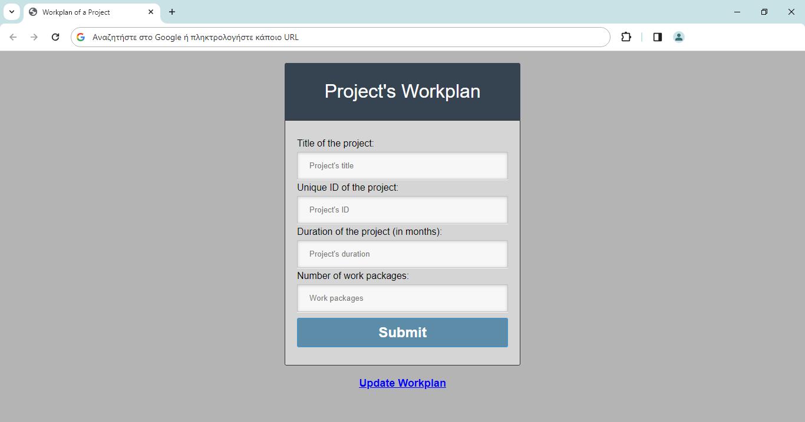

# Single-page Web Application
### **Single-page web app for the planning of a project's workplan**

In this project I developed a single-page web application, in which the user can set the workplan of a project. User can set the title and the duration of the project as well as the work packages that the workplan consists of and the tasks of it. Moreover, user can set the active periods of each task of the workplan, by filling in the corresponding fields in the form. Last but not least, user is able to update the workplan of a project that he had submitted previously, for example he can change the title of it or the title/duration of one or more work packages/tasks. The only thing he needs to know to do that is the unique id of the project.

**Technologies used**:
- HTML
- CSS
- Javascript
